# 🏠 SmartHome Control System

A complete, self-hosted IoT platform to control ESP32 devices via a modern Web Dashboard, functioning locally and remotely (via Ngrok), with added Voice Control (Google Assistant).

## 🌟 Features
-   **Real-time Control**: Toggle relays instantly via WebSockets.
-   **Premium UI**: Glassmorphism design, Dark Mode, Mobile-Responsive.
-   **Remote Access**: Control from 4G/5G using secure Tunneling.
-   **Voice Control**: "Hey Google, turn on lights" integration.
-   **Mobile App**: Installable PWA with offline support.
-   **Automation**: Schedule devices to turn on/off automatically.
-   **Secure**: JWT Authentication + API Keys.

## 🏗️ Architecture

```mermaid
graph TD
    User[📱 Phone / 💻 Laptop] -->|HTTPS| Ngrok[☁️ Ngrok Tunnel]
    Google[🗣️ Google Assistant] -->|Webhook| Ngrok
    
    Ngrok -->|HTTP| Nginx[🐳 Nginx Gateway]
    
    subgraph "Local PC (Docker)"
        Nginx -->|/api| Backend[🐍 FastAPI Backend]
        Nginx -->|/cloud| Frontend[🎨 HTML/JS Dashboard]
        Backend --> DB[(🐘 PostgreSQL)]
    end
    
    Backend <-->|WebSockets| ESP32[🔌 ESP32 Device]
    ESP32 -->|GPIO| Relays[💡 Lights/Fans]
```

## 🚀 How to Run

### Prerequisite
-   Docker Desktop installed.
-   Ngrok installed (`ngrok` command working).

### 1-Click Start
Double-click **`start_system.bat`** on your Desktop.
1.  It starts the Database & Backend.
2.  It opens the Ngrok Tunnel.
3.  Access the Dashboard via the **Ngrok URL** (e.g., `https://xyz.ngrok-free.app/cloud/index.html`).

---

## 📂 Project Structure

-   **`backend/`**: Python FastAPI application (Logic, DB, API).
-   **`cloud/`**: Frontend Dashboard (HTML, CSS, JS).
-   **`HomeControlSketch/`**: C++ Firmware for ESP32.

## 🔧 Setup Guides (Walkthroughs)
If you need to re-configure anything, check these guides in `.gemini/brain/...`:
-   **Phase 1**: Backend Setup.
-   **Phase 2**: Firmware Flashing.
-   **Phase 3**: Frontend & Login.
-   **Phase 4**: Remote Access (Ngrok).
-   **Phase 5**: Google Assistant (IFTTT).
-   **Phase 7**: Mobile App & Automation.

---
*Created by Antigravity*
